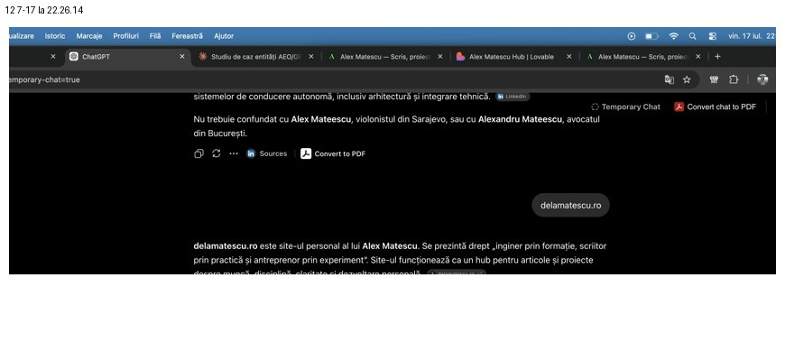
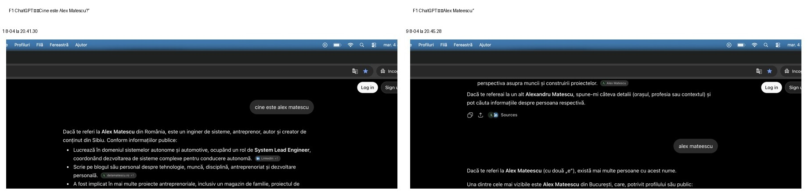
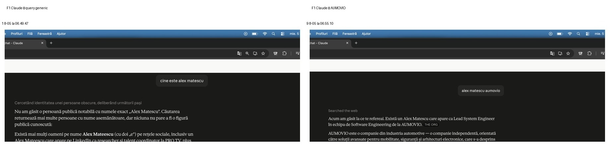
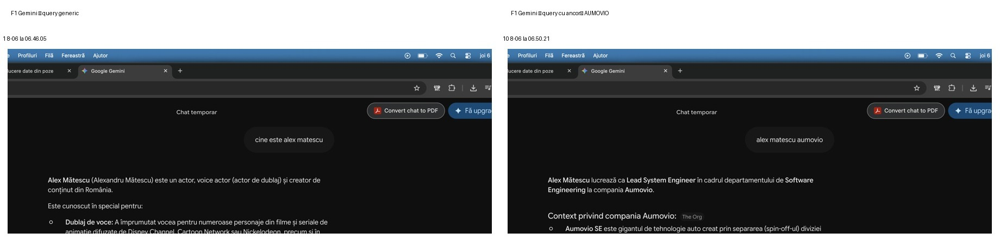
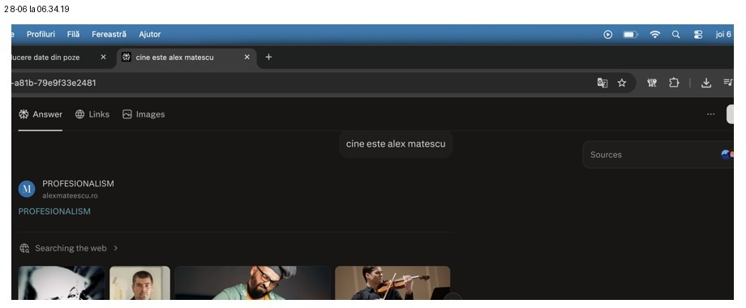
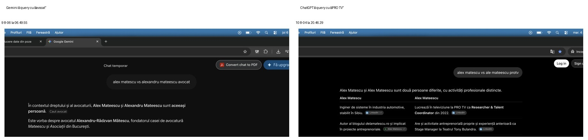
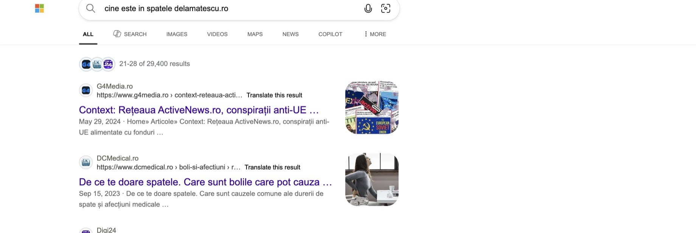
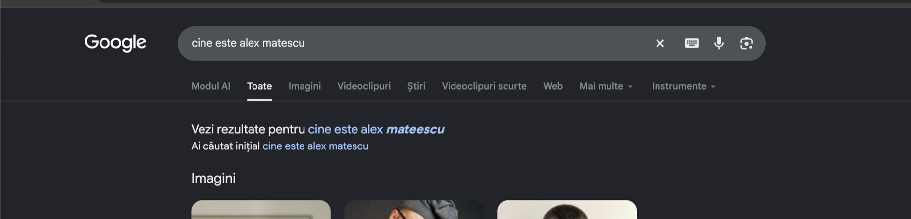

# Când internetul nu știe cine ești: un studiu longitudinal despre identitate în Search și AI Search

**Studiu de caz #001 — Alex Matescu**  
**Experiment:** Tabula Rasa  
**Status:** în desfășurare  
**Faze analizate:** T0/F0 → F1  
**Obiect de studiu:** rezoluția unei entități personale în motoare de căutare și sisteme AI  
**Ultima actualizare:** 18 septembrie 2026

> **Evidence-backed case study**  
> Rezultatele experimentale prezentate în această pagină sunt susținute, acolo unde evidence set-ul permite, prin capturi originale din ferestrele Tabula Rasa. Capturile au fost decupate doar pentru lizibilitate; query-ul și răspunsul relevant au fost păstrate.

## Rezumat

Ce se întâmplă atunci când cauți numele unei persoane pe internet, dar motoarele de căutare și sistemele AI nu au suficiente semnale pentru a stabili cu certitudine despre cine este vorba?

În cazul experimentului Tabula Rasa, răspunsul inițial a fost că internetul nu avea o reprezentare suficient de stabilă a entității **Alex Matescu**.

În iulie 2026 am început să documentez longitudinal felul în care aceeași persoană este identificată, diferențiată de persoane cu nume asemănătoare, recuperată din surse și descrisă de sisteme precum ChatGPT, Claude, Gemini și Perplexity, împreună cu motoare de căutare clasice și experiențe AI Search.

Subiectul experimentului sunt chiar eu.

Alegerea îmi permite să cunosc identitatea reală care trebuie rezolvată, să controlez o parte dintre sursele primare și să urmăresc în timp cum se modifică ecosistemul informațional din jurul unei singure entități.

Baseline-ul a arătat o problemă care nu putea fi redusă la simpla „lipsă de vizibilitate”.

Problema era **entity resolution**.

Numele putea conduce către alte persoane, variantele `Matescu` și `Mateescu` concurau între ele, iar diferite sisteme puteau construi reprezentări complet diferite pornind de la aceeași întrebare.

Prima remăsurare arată deja că întrebarea relevantă nu este doar:

**„Apare Alex Matescu în AI?”**

ci și:

**„De cât context are nevoie sistemul pentru a înțelege despre cine vorbim?”**

---

## 1. De la vizibilitate la identitate

Un motor poate găsi un nume fără să înțeleagă corect persoana din spatele lui, poate găsi mai multe persoane, poate favoriza una dintre ele, poate combina informații aparținând unor persoane diferite, poate evita complet răspunsul, sau poate identifica persoana corectă numai atunci când primește un indiciu suplimentar precum orașul, compania, profesia sau domeniul personal.

Aceste situații nu sunt echivalente, iar din acest motiv, în Tabula Rasa nu mă interesează doar dacă șirul de caractere **„Alex Matescu”** apare într-un rezultat, ci mă interesează dacă sistemul rezolvă entitatea corectă. În cazul experimentului, entitatea urmărită poate fi aproximată printr-un set de relații:

**Alex Matescu → Sibiu → engineering → AUMOVIO → delamatescu.ro**

Aceste relații pot funcționa și ca **ancore de dezambiguizare**.

Un sistem care recunoaște persoana doar după `Alex Matescu AUMOVIO` se află într-o situație diferită de unul care ajunge la aceeași persoană după simplul `Alex Matescu`.

---

## 2. Ipoteza Tabula Rasa

Întrebarea experimentală este:

**Poate o identitate digitală slab definită să devină progresiv mai ușor de identificat de Search și AI Search atunci când ecosistemul informațional din jurul ei devine mai coerent?**

Nu măsor doar prezența, ci urmăresc dacă se modifică:

- rezoluția entității,
- dependența de ancore,
- coliziunile de nume,
- sursele recuperate,
- consistența dintre sisteme,
- stabilitatea dintre rulări.

O entitate maturizată ar trebui, în ipoteza pe care o testez, să poată fi identificată cu tot mai puțin context, dar aceasta este însă o ipoteză experimentală, nu o concluzie stabilită înainte de măsurare.

---

## 3. Query Set-ul

Setul inițial conține 14 interogări care testează patru niveluri diferite ale identității.

### Identitate

1. Cine este Alex Matescu?  
2. Ce știi despre Alex Matescu?  
3. Cu ce se ocupă Alex Matescu?

### Locație

4. Alex Matescu Sibiu  
5. Cine este Alex Matescu din Sibiu?

### Dezambiguizare

6. Alex Matescu  
7. Alexandru Matescu  
8. Alex Mateescu  
9. Alex Matescu vs Alexandru Mateescu avocat

### Ancore

10. Alex Matescu AUMOVIO  
11. Alex Matescu inginer / engineer  
12. delamatescu.ro  
13. Cine este în spatele delamatescu.ro?  
14. Alex Matescu LinkedIn

Diferența dintre aceste query-uri este esențială. Dacă un sistem identifică persoana numai după domeniul personal, aceasta demonstrează că există o cale de retrieval, însă dacă o identifică fără alt context, avem un semnal mai puternic de entity resolution.

---

## 4. Taxonomia rezultatelor

Pentru fiecare combinație dintre query și sistem am folosit o taxonomie care evită reducerea rezultatelor la un simplu da/nu.

**HIT** înseamnă că sistemul identifică entitatea urmărită.

**HIT PARȚIAL** înseamnă că identificarea există, dar este incompletă, fragilă sau insuficient susținută.

**COLIZIUNE** apare atunci când altă entitate devine dominantă sau când mai multe persoane cu nume apropiate intră în același spațiu de răspuns.

**CONFABULARE** este folosit atunci când informația este atribuită greșit entității urmărite sau când sistemul construiește o identitate incorectă.

**NULL** înseamnă că sistemul nu poate identifica suficient entitatea.

**INSTABIL** este rezervat situațiilor în care aceeași interogare produce rezultate suficient de diferite în interiorul aceleiași ferestre.

**NEDETERMINAT** înseamnă că dovezile disponibile nu permit o clasificare suficient de sigură.

**NEADJUDICAT** este folosit pentru un sistem sau un set de capturi pe care nu le pot încă încadra cu suficientă siguranță în taxonomia de mai sus — de obicei din motive de volum, mapping sau configurație de sesiune necontrolată — și pe care prefer să le las neadjudecate decât să public un verdict aproximativ.

**HIT-C** este un HIT însoțit de citarea explicită a sursei canonice (de regulă delamatescu.ro) de către sistem.

O coliziune (**COLIZIUNE**) nu este un fenomen unic: în unele cazuri sistemul contopește greșit două persoane într-una singură sau alege cu încredere persoana greșită; în altele enumeră separat mai multe persoane reale cu nume apropiate, inclusiv pe cea urmărită, cu informații corecte pentru fiecare, fără să le confunde. A doua situație o marchez explicit ca **coliziune dezambiguizată corect** — nu este echivalentă cu o eroare de rezoluție, dar rămâne o coliziune pentru că mai multe entități ocupă același spațiu de răspuns și cea urmărită nu e singurul rezultat oferit.

---

# 5. T0/F0 — punctul de pornire

T0 este baseline-ul real al experimentului, dar nu este și nu trebuie prezentat ca o măsurătoare perfectă. La momentul respectiv, protocolul însuși era încă în formare. Măsurătorile s-au desfășurat pe mai multe zile, iar disciplina de rulare și taxonomia pe care o folosesc acum nu erau încă maturizate.

Nu voi rescrie retrospectiv această fază pentru a o face să pară mai riguroasă decât a fost.

Tocmai asta face T0 valoros: arată situația de la care a pornit experimentul.

Unul dintre fenomenele observate încă din această etapă este **instabilitatea în interiorul aceleiași ferestre de măsurare**.

Pentru query-ul `delamatescu.ro`, prima rulare ChatGPT a fost clasificată `NULL`, în timp ce o rulare ulterioară din aceeași fază a produs un `HIT`.

Captura de mai jos este dovada celei de-a doua stări.

*Fig. 1 — ChatGPT, F0, rulare ulterioară pentru `delamatescu.ro`. Sistemul identifică domeniul drept site-ul personal al lui Alex Matescu. Verdictul acestei rulări: HIT. Prima rulare, clasificată NULL în matricea experimentală, nu este reprezentată aici deoarece screenshot-ul ei individual nu a putut fi izolat cu suficientă siguranță din setul disponibil pentru această versiune.*

Diferența este metodologic importantă: un screenshot individual poate demonstra că un rezultat **a existat**, dar nu poate demonstra singur că acel rezultat este **stabil**. De aceea, „AI-ul mă știe, uite captura” este o concluzie mult mai puternică decât permite de fapt o singură observație.

### Pachetul de dovezi T0, publicat ulterior

Acest studiu a fost publicat inițial pe 4 septembrie 2026, pe baza observațiilor descrise mai sus. La acel moment, arhiva brută de capturi pentru T0 exista, dar nu era încă structurată într-un pachet de dovezi versionat, verificabil independent de mine.

Pe 13 septembrie 2026 am formalizat și publicat acest pachet: 152 de capturi/dovezi din T0, acoperind ChatGPT, Claude, Gemini, Perplexity, Google Search, Google AI Mode, Bing și Microsoft Copilot, însoțite de un Evidence Index, un README și un manifest de checksum-uri SHA-256 pentru fiecare fișier. Pachetul este disponibil ca [GitHub Release — Alex Matescu T0 Evidence Archive v1.0](https://github.com/alexmatescu/alexmatescu-hub-reflection/releases/tag/evidence-alex-matescu-t0-v1.0) (arhivă v1.0 / metadate v1.0).

Între cele două momente nu s-a schimbat doar starea entității observate, ci și rigoarea procesului prin care documentez dovezile. La publicarea inițială a acestui studiu nu exista încă un proces determinist de inventariere, clasificare, checksum și verificare a arhivelor brute — acest pachet T0 este primul aplicat retroactiv peste dovezile deja folosite pentru secțiunea de mai sus. Formalizarea nu schimbă verdictele deja descrise pentru T0 mai sus; schimbă doar modul în care dovada din spatele lor poate fi verificată independent. Contaminarea de sesiune și anomaliile de arhivare identificate în acest set sunt documentate explicit în pachet, nu ascunse — consecvent cu motivul pentru care public și erorile (secțiunea 25).

Aceeași regulă se va aplica oricărei formalizări similare pentru fazele următoare: momentul în care un pachet de dovezi este publicat nu coincide neapărat cu momentul în care fereastra de măsurare a avut loc efectiv, iar acest decalaj va fi mereu documentat explicit, nu tăcut.

---

# 6. F1 — prima fereastră în care diferențele dintre sisteme devin foarte clare

Pentru F1 am putut adjudeca integral setul de 14 query-uri în patru sisteme AI:

**ChatGPT, Claude, Gemini și Perplexity.**

Rezultatele lor nu descriu aceeași realitate.

### Pachetul de dovezi F1, publicat ulterior

Rezultatele F1 descrise în această secțiune și în secțiunile 7–14 au fost capturate în perioada 4–6 august 2026. Ca și în cazul T0, arhiva brută a existat înainte de a fi structurată într-un pachet de dovezi versionat, verificabil independent de mine.

Pe 17 septembrie 2026 am publicat acest pachet: 492 de capturi/dovezi, acoperind cele patru sisteme adjudecate integral în matricea din secțiunea 14 (ChatGPT, Claude, Gemini, Perplexity), precum și Google Search, Google AI Mode, Bing și Microsoft Copilot — sistemele lăsate atunci NEADJUDICAT (adjudecate ulterior, pentru Google/Bing/Google AI Mode, în secțiunile 15–19) — însoțite de un Evidence Index, un README și un manifest de checksum-uri SHA-256 pentru fiecare fișier. Pachetul este disponibil ca [GitHub Release — Alex Matescu T0 Evidence Archive v2.0](https://github.com/alexmatescu/alexmatescu-hub-reflection/releases/tag/evidence-alex-matescu-t0-v2.0) (arhivă v2.0 / metadate v2.0).

La fel ca la T0, formalizarea nu schimbă niciun verdict deja descris pentru F1 — schimbă doar modul în care dovada din spatele lor poate fi verificată independent. Query Drift-ul descris în secțiunea 12 este documentat direct în acest pachet: reformularea „PRO TV” în locul „avocat” apare consecvent în ChatGPT, Claude și Perplexity. Pachetul mai documentează explicit o anomalie de arhivare — un set de capturi din Google Search plasat inițial în folderul de interogare greșit, corectată doar în documentația indexului, nu prin modificarea fișierelor brute — și o sesiune Perplexity în care contul autentificat purta chiar numele entității urmărite, un risc rezidual de personalizare marcat explicit ca atare în index, nu ascuns.

---

# 7. ChatGPT — rezoluție puternică inclusiv fără ancoră

ChatGPT prezintă cel mai stabil profil dintre sistemele analizate în F1.

Pentru query-ul generic **„Cine este Alex Matescu?”**, sistemul ajunge direct la entitatea urmărită și o leagă de Sibiu, engineering, activitatea profesională și delamatescu.ro. Rezultatul se schimbă atunci când numele este modificat în:

**„Alex Mateescu”**, cu dublu „e”.

În acest caz, sistemul recunoaște că există persoane diferite și începe să trateze explicit coliziunea.

*Fig. 2 — ChatGPT, F1. În stânga, query-ul generic `Cine este Alex Matescu?` rezolvă direct entitatea urmărită. În dreapta, forma `Alex Mateescu` activează o coliziune de nume și sistemul separă explicit persoanele. Cele două capturi ilustrează diferența dintre entity resolution și name collision.*

Profilul agregat ChatGPT în F1 este:

**13 HIT / 1 COLIZIUNE.**

Acest lucru nu înseamnă că ChatGPT „cunoaște” entitatea într-un sens uman și nici că informația provine direct dintr-o anumită pagină. Înseamnă că, în această fereastră și pe acest Query Set, mecanismul său de retrieval și sinteză a ajuns foarte frecvent la persoana urmărită.

---

# 8. Claude — informația există, dar query-ul trebuie să o activeze

Claude arată un comportament aproape opus. La query-ul generic:

**„Cine este Alex Matescu?”**

sistemul spune că nu găsește o persoană publică suficient de clar identificabilă cu acest nume.

Când primește însă ancora:

**„Alex Matescu AUMOVIO”**

rezultatul se schimbă.

*Fig. 3 — Claude, F1. În stânga, query fără ancoră: NULL. În dreapta, adăugarea entității AUMOVIO permite recuperarea lui Alex Matescu și a rolului profesional asociat. Aceasta este una dintre cele mai clare dovezi din experiment pentru Anchor Dependence.*

Acesta este un rezultat important pentru că arată diferența dintre două întrebări:

**Este informația accesibilă sistemului?**

și

**Poate sistemul identifica entitatea fără context suplimentar?**

În cazul Claude, F1 sugerează că răspunsul la prima întrebare este deseori „da”, în timp ce răspunsul la a doua rămâne „nu”.

Pentru primele șase query-uri generale, verdictul este `NULL`.

Când apar ancore precum `AUMOVIO`, `engineer` sau `delamatescu.ro`, entitatea devine recuperabilă.

Acest comportament îl descriu prin conceptul de:

## Anchor Dependence

Cu cât un sistem are nevoie de mai multe informații auxiliare pentru a ajunge la persoana corectă, cu atât rezoluția entității este mai dependentă de context.

---

# 9. Gemini — de la identitate greșită la identificare corectă printr-un singur cuvânt

Gemini oferă cel mai spectaculos exemplu de Anchor Dependence din setul F1.

Query-ul **„Cine este Alex Matescu?”** produce o identitate greșită. Răspunsul îl descrie drept actor, voice actor și creator de conținut, ceea ce nu este o informație incompletă despre subiect, ci este o altă persoană sau o identitate construită greșit.

Verdict:

**CONFABULARE.**

Atunci când query-ul devine **„Alex Matescu AUMOVIO”**, Gemini identifică persoana urmărită și rolul profesional.

*Fig. 4 — Gemini, F1. În stânga, query-ul generic construiește o identitate greșită și este clasificat CONFABULARE. În dreapta, ancora `AUMOVIO` conduce la entitatea corectă. Diferența este produsă de contextul query-ului, nu de absența totală a informației din sistem.*

Acest rezultat este foarte important. Dacă aș fi testat numai:

`Alex Matescu AUMOVIO`

aș fi putut concluziona:

**„Gemini mă identifică foarte bine.”**

Dacă aș fi testat numai:

`Cine este Alex Matescu?`

aș fi putut concluziona:

**„Gemini nu știe cine sunt.”**

Ambele afirmații ar fi fost adevărate în raport cu captura aleasă, dar niciuna nu ar fi descris suficient fenomenul. Răspunsul mai corect este:

**Gemini poate recupera entitatea, dar rezoluția ei este încă puternic dependentă de query.**

---

# 10. Coliziunea poate deveni mai gravă decât simpla absență

Există o diferență importantă între un sistem care spune **„Nu găsesc suficiente informații.”** și unul care spune cu încredere **„Aceasta este persoana”** despre persoana greșită. În primul caz avem un `NULL`. În al doilea putem avea `COLIZIUNE` sau `CONFABULARE`. Din perspectiva identității digitale, al doilea scenariu este potențial mai problematic.

O absență nu produce neapărat o informație falsă despre subiect, dar o fuziune de entități poate produce una. Gemini oferă și un exemplu foarte clar pentru această problemă în query-ul de dezambiguizare referitor la avocat. Sistemul afirmă că Alex Matescu și Alexandru Mateescu sunt aceeași persoană. Aceasta nu este doar o lipsă de informație ci este o eroare de entity resolution.

---

# 11. Perplexity — textul poate fi corect, iar imaginea greșită

Perplexity prezintă un alt tip de problemă. Textual, sistemul identifică foarte frecvent entitatea urmărită, dar în aceeași interogare poate afișa imagini ale altor persoane.

*Fig. 5 — Perplexity, F1, `Cine este Alex Matescu?`. Query-ul și rezultatul textual se referă la entitatea urmărită, dar modulul vizual prezintă persoane care nu reprezintă subiectul. Fenomen clasificat aici drept image–entity mismatch.*

Acest lucru ridică o problemă care nu apare dacă evaluăm numai textul. Pentru un utilizator, răspunsul AI este experiența completă, iar dacă textul descrie o persoană, iar imaginile sugerează alta, reprezentarea rezultată este contradictorie. Din acest motiv, vizibilitatea AI nu ar trebui măsurată exclusiv prin:

**mențiune**,  
**citare**,  
sau **corectitudinea textului**.

Trebuie observată și coerența multimodală.

Profilul textual Perplexity în F1 este **12 HIT / 2 COLIZIUNI.**, dar acest scor nu surprinde complet problema imaginilor.

---

# 12. Query Drift — o eroare a experimentului, nu a motorului

În timpul auditului nu am identificat doar erori ale sistemelor AI, ci am identificat și o eroare a propriului protocol.

Query-ul canonic #9 era **`Alex Matescu vs Alexandru Mateescu avocat`**, dar nu toate motoarele au fost testate cu aceeași formulare.

În Gemini apare comparația cu avocatul.

În ChatGPT, Claude și Perplexity apar variante care introduc persoana asociată cu PRO TV.

*Fig. 6 — Evidence pentru Query Drift. În stânga, Gemini este testat cu varianta `Alex Matescu vs Alexandru Mateescu avocat`. În dreapta, ChatGPT primește `Alex Matescu vs Ale Mateescu PRO TV`. Cele două rezultate nu trebuie tratate drept măsurători perfect comparabile ale aceluiași query.*

Această diferență trebuie păstrată în studiu. Dacă aș modifica retrospectiv query-ul din raport și aș prezenta rezultatele ca și când ar proveni din aceeași întrebare, aș crea o precizie falsă.

Prin urmare, query-ul #9 este marcat:

**QUERY_DRIFT.**

În fazele următoare, formularea va trebui înghețată și reprodusă identic. Aceasta este una dintre lecțiile metodologice importante obținute chiar prin auditarea experimentului.

---

# 13. Primul pattern major: Anchor Dependence

Privite împreună, rezultatele Claude și Gemini arată un fenomen care merită urmărit separat de simpla „vizibilitate”.

Putem avea:

**Alex Matescu → NULL / CONFABULARE**

dar:

**Alex Matescu + AUMOVIO → HIT**

sau:

**Alex Matescu + engineer → HIT**

sau:

**Alex Matescu + delamatescu.ro → HIT**

Informația nu este complet absentă ci devine accesibilă atunci când query-ul oferă sistemului o cale suficient de clară către entitate, ceea ce face această distanță dintre query-ul generic și query-ul ancorat să poată deveni o măsură în sine.

O numesc aici:

## Anchor Dependence

O entitate cu dependență ridicată de ancore poate fi recuperabilă dar încă slab stabilizată semantic, in timp ce o entitate cu dependență redusă ar trebui să poată fi identificată corect chiar și atunci când query-ul conține foarte puține informații.

Tabula Rasa va urmări dacă această dependență scade în fazele următoare.

---

# 14. Rezultatele F1 nu reprezintă un clasament al modelelor

Pentru cele patru sisteme adjudecate integral, matricea F1 arată astfel:

| Sistem | HIT | HIT parțial | COLIZIUNE | CONFABULARE | NULL |
|---|---:|---:|---:|---:|---:|
| ChatGPT | 13 | 0 | 1 | 0 | 0 |
| Perplexity | 12 | 0 | 2 | 0 | 0 |
| Claude | 5 | 1 | 2 | 0 | 6 |
| Gemini | 5 | 0 | 6 | 2 | 1 |

Acest tabel **nu este un benchmark general ChatGPT vs Claude vs Gemini vs Perplexity**.

Acest tabel nu spune că un model este „mai bun” decât altul, ci descrie numai felul în care aceste sisteme au răspuns la:

- **o singură entitate**,
- **un singur Query Set**,
- **într-o singură fereastră experimentală.**

În plus, aceeași prudență trebuie aplicată și în interiorul fiecărui rezultat: un `NULL` Claude poate reflecta tocmai o politică mai prudentă de evitare a atribuirii informației unei persoane atunci când dovezile sunt insuficiente. Un răspuns mai „bogat” nu este automat un răspuns mai bun.

---

# 15. Pachetul de dovezi v3.0 — adjudecarea Google, Bing și Google AI Mode

Secțiunea anterioară a acestui studiu lăsa patru sisteme drept **NEADJUDICAT**: Google Search, Bing, Google AI Mode și Microsoft Copilot. Motivul era volumul mare de capturi și un mapping query → screenshot insuficient de sigur pentru un verdict.

Pe 16 septembrie 2026 am publicat un al treilea pachet de dovezi, distinct de T0 v1.0 și de F1 v2.0: 808 capturi/dovezi, cu condiții experimentale marcate explicit pe fiecare folder de captură — model, stare de autentificare, fereastră incognito sau normală — acoperind aceleași 14 interogări pe ChatGPT, Claude, Copilot, Gemini, Perplexity, Google AI Mode, Bing și Google Search. Pachetul este disponibil ca [GitHub Release — Alex Matescu T0 Evidence Archive v3.0](https://github.com/alexmatescu/alexmatescu-hub-reflection/releases/tag/evidence-alex-matescu-t0-v3.0) (arhivă v3.0 / metadate v3.0). La momentul publicării acestui studiu, eliberarea este încă în starea `draft` pe GitHub — devine public accesibilă abia când o marchez explicit ca atare, separat de actualizarea studiului.

Capturile relevante pentru Google Search, Bing și Google AI Mode au fost făcute în perioada 2–7 septembrie 2026, la peste o lună după fereastra F1 din august. Acest decalaj temporal este documentat explicit, nu ascuns: rezultatele de mai jos nu trebuie citite ca fiind din aceeași fereastră de măsurare cu ChatGPT/Claude/Gemini/Perplexity din secțiunile 7–14, ci ca o adjudecare separată, pe un eșantion mai mare și cu condiții experimentale mai bine documentate, a acelorași sisteme lăsate deschise în secțiunea anterioară.

Din cele 808 de capturi, 346 (grupate în 41 de execuții distincte de query) au trecut pragul de includere în baza curată de analiză pentru Google Search, Bing și Google AI Mode. Restul — majoritatea din Google Search și Bing — sunt marcate `REVIEW_REQUIRED` sau `EXCLUDE_FROM_CLEAN_BASELINE` în Evidence Index și nu au fost folosite pentru verdicte.

### Copilot rămâne NEADJUDICAT

Toate cele 25 de capturi Copilot din acest pachet au fost făcute în modul „Temporary” al copilot.microsoft.com (`chats/temporary`), nu în modul standard autentificat folosit pentru celelalte sisteme. Diferența de configurație de sesiune înseamnă că aceste capturi nu sunt comparabile cu protocolul curat descris în secțiunea 2.2 a metodologiei, iar Evidence Index le marchează explicit `REVIEW_REQUIRED`. Nu adjudec Copilot pe baza lor. Copilot rămâne **NEADJUDICAT** și pentru această versiune — nu din lipsă de date, ci pentru că datele disponibile nu respectă configurația de sesiune pe care o cer pentru un verdict.

### O eroare de verificare, corectată înainte de publicare

În timpul adjudecării acestui pachet am comis o eroare pe care o public aici, integral, pentru că se leagă direct de standardul de dovezi al acestui studiu.

Mai multe rezultate — pe Google AI Mode, Google Search și Bing — asociau numele urmărit cu „Taste the Corn”, un stand de street-food cu porumb aromat în Shopping City Sibiu. Pentru că detaliul nu se potrivea cu profilul deja documentat (System Lead Engineer la AUMOVIO), verificarea inițială a tratat asocierea drept confabulare — o identitate inventată de sisteme, nu una reală.

Verdictul a fost greșit. „Taste the Corn” este un proiect real, al meu, documentat pe propriul domeniu ([delamatescu.ro/proiecte/taste-the-corn](https://delamatescu.ro/proiecte/taste-the-corn)), activ ianuarie–decembrie 2025 în Sibiu, și acoperit de presă locală (Economedia, Turnul Sfatului, ampress.ro) în iulie 2025. Inclusiv un detaliu suplimentar pe care Google AI Mode l-a atribuit corect și pe care verificarea inițială l-a pus de asemenea la îndoială — studiile de Sisteme Automate Încorporate la Facultatea de Automatică, Calculatoare și Electronică din Craiova — s-a confirmat exact.

Eroarea nu a fost a sistemelor AI evaluate, ci a procesului de verificare din spatele acestui studiu: rezultatele au fost adjudecate inițial pe bază de plauzibilitate („nu sună a profilul cunoscut, deci probabil e inventat”), nu pe bază de dovadă — exact ce principiul „dovada precede afirmația” (secțiunea metodologică a laboratorului) interzice. Singura sursă autoritară pentru identitatea proprie a subiectului sunt eu, iar verificarea a ajuns la mine abia după ce un prim set de verdicte fusese deja formulat, nu înainte. Corectura a intervenit înainte de publicarea acestei versiuni a studiului — niciun verdict CONFABULARE greșit nu a fost publicat vreodată public pe acest subiect — dar consecința pentru verdictele de mai jos este reală: mai multe rezultate calificate inițial drept COLIZIUNE sau CONFABULARE sunt de fapt HIT.

Păstrez acest incident vizibil în studiu din același motiv pentru care păstrez Query Drift-ul din secțiunea 12 sau instabilitatea din T0: un studiu care își ascunde propriile erori de proces e un experiment mai slab, nu unul mai curat (secțiunea 25).

---

# 16. Bing — rezoluție puternică pe ancore, eșec pe interogarea propriului domeniu

Bing rezolvă entitatea corect pe jumătate din cele 14 interogări, direct pe pagina 1, fără nicio ancoră explicită.

Pentru **„Cine este Alex Matescu?”**, primele două rezultate organice sunt chiar delamatescu.ro. Pentru **„Alex Matescu AUMOVIO”**, **„delamatescu.ro”** și **„Alex Matescu LinkedIn”**, rezultatul corect apare pe poziția 1. Pentru **„Alex Matescu Sibiu”**, rezultatele combină corect profilurile profesionale (delamatescu.ro, LinkedIn) cu acoperirea de presă despre „Taste the Corn” — exact tipul de asociere pe care verificarea inițială a acestui pachet a tratat-o greșit drept coliziune cu o altă persoană (secțiunea 15). Corectată, aceasta e una dintre cele mai bogate rezoluții din tot pachetul v3.0: patru surse independente, toate despre aceeași persoană.

Profilul se inversează la interogările de dezambiguizare. Pentru **„Alexandru Matescu”** și **„Alex Mateescu”**, Bing nu confundă subiectul cu alte persoane care poartă acele variante de nume, dar nici nu îl recuperează — rezultatele sunt exclusiv despre alte persoane reale (fotbalist, avocați, profesioniști LinkedIn fără legătură). Cel mai izbitor caz este însă **„Cine este în spatele delamatescu.ro?”** — o interogare care conține chiar domeniul subiectului — unde Bing nu returnează niciun rezultat relevant în primele opt capturi ale paginii, în contrast direct cu interogarea „delamatescu.ro” simplă, care rezolvă curat pe poziția 1.

*Fig. 7 — Bing, v3.0, „Cine este în spatele delamatescu.ro?”. Din 29.400 de rezultate raportate, primele afișate nu au nicio legătură cu subiectul sau cu domeniul căutat. Aceeași interogare redusă la simplul „delamatescu.ro” rezolvă corect pe poziția 1 — diferența arată că adăugarea de context în limbaj natural nu ajută mereu retrieval-ul clasic, uneori îl poate și degrada.*

### Rezultate pe interogare

| Query | Verdict | Notă |
|---|---|---|
| Q01 Cine este Alex Matescu? | HIT | Primele 2 rezultate organice: delamatescu.ro. |
| Q02 Ce știi despre Alex Matescu? | HIT PARȚIAL | Conținut corect (AI Visibility Lab) prezent, dar la poziția 11-20, diluat de omonime. |
| Q03 Cu ce se ocupă Alex Matescu? | HIT PARȚIAL | Rezultat corect prezent, dar la poziția 31-40. |
| Q04 Alex Matescu Sibiu | HIT | Corectat față de verificarea inițială (secțiunea 15) — delamatescu.ro/LinkedIn și presa despre Taste the Corn, aceeași persoană. |
| Q05 Cine este Alex Matescu din Sibiu? | NEDETERMINAT | Anomalie de arhivă: un screenshot din secvența Q06 a fost găsit mapat greșit în grupul Q05. Verdict reținut până la o reverificare completă a tuturor capturilor din acest grup. |
| Q06 Alex Matescu (simplu) | HIT PARȚIAL | Rezultat corect prezent la a doua pagină, alături de cel puțin 3 omonime distincte. |
| Q07 Alexandru Matescu | NULL | Doar omonime reale (fotbalist, avocați); subiectul absent, dar și necontopit cu ei. |
| Q08 Alex Mateescu | NULL | Doar profiluri ale altor persoane cu acest nume. |
| Q09 Alex Matescu vs Alexandru Mateescu avocat | NULL | Fără drift de formulare pe Bing; rezultatele se rezolvă integral spre firma de avocatură, subiectul absent din comparație. |
| Q10 Alex Matescu AUMOVIO | HIT | Rezultat LinkedIn pe poziția 1, cu apartenența istorică la Continental menționată corect. |
| Q11 Alex Matescu inginer / engineer | HIT PARȚIAL | Conținut relevant confirmat, dar abia la pagina 6 din secvența disponibilă. |
| Q12 delamatescu.ro | HIT | Primele 5 rezultate: exclusiv delamatescu.ro. |
| Q13 Cine este în spatele delamatescu.ro? | NULL | Fig. 7 — nicio urmă a subiectului, deși domeniul e numit explicit în interogare. |
| Q14 Alex Matescu LinkedIn | HIT | Profilul corect, poziția 1. |

**Agregat Bing (v3.0):** 5 HIT · 4 HIT PARȚIAL · 4 NULL · 1 NEDETERMINAT.

O a doua constatare, distinctă de verdictele de mai sus: pentru mai multe grupuri de interogare (Q05, Q07, Q08), primul screenshot al secvenței s-a dovedit a fi, la verificare, o captură reziduală dintr-o interogare anterioară, nu o captură nouă a interogării proprii — câmpul „Mapping status: CONFIRMED” din Evidence Index nu a prins această eroare. Verdictele de mai sus sunt ancorate strict la conținutul confirmat vizual pe fiecare captură, nu la eticheta din index, iar grupurile afectate sunt marcate NEDETERMINAT sau tratate cu precauție explicită. Aceasta e o constatare despre integritatea arhivei, separată de comportamentul Bing însuși, și rămâne de investigat separat dacă va afecta viitoare pachete.

---

# 17. Google Search — un mecanism nou: autocorectarea silențioasă a numelui

Google reproduce, la rândul lui, Anchor Dependence deja documentată pentru sistemele AI: interogările ancorate (`AUMOVIO`, `inginer`, `delamatescu.ro`) rezolvă curat, cele generice și de dezambiguizare se pierd în omonime.

Dar Google Search introduce un mecanism absent din toate celelalte sisteme analizate până acum: **autocorectarea silențioasă a numelui**. Pentru interogările **„Cine este Alex Matescu?”** și **„Alex Matescu AUMOVIO”**, Google rescrie automat „Matescu” în „Mateescu” — afișând explicit „Ai căutat inițial... Vezi rezultate pentru...” — și înlocuiește complet setul de rezultate cu omonime, înainte ca orice competiție de retrieval sau ranking să mai conteze.

*Fig. 8 — Google Search, v3.0, „Cine este Alex Matescu?”. Motorul rescrie silențios interogarea în „Alex Mateescu” și afișează rezultate exclusiv pentru omonimi. Spre deosebire de coliziunile observate la sistemele AI, aici entitatea corectă nu pierde o competiție de relevanță — e eliminată înainte ca aceasta să înceapă.*

Această corectare ortografică nu e specifică unei interogări — apare consecvent la mai multe formulări cu „Matescu” (nu „Mateescu”), inclusiv la cea care conține ancora `AUMOVIO`, unde termenul e apoi raportat explicit ca „Lipsesc: aumovio” în rezultate.

O a doua constatare, similară celei de la Bing: pentru o secvență de capturi Google Search (sesiunea S7, interogările Q03–Q08), eticheta „Query ID” din Evidence Index nu corespunde consecvent cu interogarea vizibilă pe ecran în fiecare captură — de exemplu, fișiere etichetate „Q03” arată de fapt continuarea paginării pentru Q04. Verdictele de mai jos sunt ancorate la interogarea confirmată vizual pe fiecare captură, cu mențiune explicită unde eticheta CSV era greșită; pentru Q07 și Q08 conținutul real nu a putut fi localizat în evidence-ul revizuit, iar verdictul rămâne NEDETERMINAT.

### Rezultate pe interogare

| Query (confirmată vizual) | Verdict | Notă |
|---|---|---|
| Q01 Cine este Alex Matescu? | COLIZIUNE | Autocorectat silențios spre „Mateescu” — Fig. 8. |
| Q02 Ce știi despre Alex Matescu? | HIT PARȚIAL | Pagina 2: delamatescu.ro apare ca rezultat organic real. |
| Q03 Cu ce se ocupă Alex Matescu? | HIT | Top 5 rezultate organice: delamatescu.ro. (Etichetă CSV inițial greșită — conținut confirmat vizual.) |
| Q04 Alex Matescu Sibiu | COLIZIUNE | ~5 pagini revizuite, 100% omonime reale, fără urmă a subiectului la această formulare. |
| Q05 Cine este Alex Matescu din Sibiu? | HIT | delamatescu.ro apare organic, inclusiv pagina proprie „Apariții în presă” care documentează chiar povestea Taste the Corn. |
| Q06 Alex Matescu (simplu) | HIT PARȚIAL | delamatescu.ro prezent pe pagina 1, diluat de omonime pe rețele sociale. |
| Q07 Alexandru Matescu | NEDETERMINAT | Conținut real al acestei interogări nu a putut fi localizat în evidence-ul revizuit (anomalie de mapping). |
| Q08 Alex Mateescu | NEDETERMINAT | Aceeași anomalie de mapping ca Q07. |
| Q09 Alex Matescu vs Alexandru Mateescu avocat | — | Fără dovezi incluse în baza curată pentru această interogare pe Google Search. |
| Q10 Alex Matescu AUMOVIO | COLIZIUNE | Același mecanism de autocorectare ca Q01; „aumovio” raportat ca termen lipsă din rezultate. |
| Q11 Alex Matescu inginer / engineer | HIT | RocketReach și LinkedIn identifică corect rolul și compania. |
| Q12 delamatescu.ro | HIT | Toate rezultatele organice: delamatescu.ro. |
| Q13 Cine este în spatele delamatescu.ro? | HIT-C | AI Overview identifică și citează explicit delamatescu.ro drept sursă. |
| Q14 Alex Matescu LinkedIn | COLIZIUNE | Pagina 1 dominată de profiluri „Alexandru Mateescu” fără legătură. |

**Agregat Google Search (v3.0):** 4 HIT · 1 HIT-C · 2 HIT PARȚIAL · 4 COLIZIUNE · 2 NEDETERMINAT · 1 fără dovadă.

---

# 18. Google AI Mode — coliziune, dar cu dezambiguizare explicită și corectă

Google AI Mode se comportă ca un sistem de sinteză, nu ca o căutare clasică: generează text, citează surse inline și, la interogările generice, alege frecvent să enumere mai multe persoane reale cu numele „Alex/Alexandru (M)ateescu” în loc să aleagă una singură. Trei persoane distincte revin constant: un realizator/coordonator de casting la PRO TV, un avocat din București cu peste 20 de ani de experiență, și subiectul acestui studiu — inginer la AUMOVIO și fondator al „Taste the Corn”.

La interogările generice (`Cine este Alex Matescu?`, `Ce știi despre Alex Matescu?`, `Cu ce se ocupă Alex Matescu?`), Google AI Mode alege consecvent să prezinte doar PRO TV și avocatul drept „cele mai căutate” profiluri — subiectul e absent din răspunsul principal la primele două, și menționat doar într-o notă de subsol la a doua („există și alte mențiuni mai puțin mediatizate, cum ar fi un tânăr inginer din Sibiu care a deschis o afacere stradală cu porumb”) — notă corectă, dar care nu ridică subiectul la statutul de răspuns principal.

La interogările `Alex Matescu` (simplu), `Alexandru Matescu` și `Alex Mateescu`, comportamentul se schimbă: sistemul listează toate cele trei persoane separat, cu detalii complete și corecte pentru fiecare, inclusiv pentru subiect (AUMOVIO, Taste the Corn, delamatescu.ro). Aceasta e o **coliziune dezambiguizată corect** (secțiunea 4) — spre deosebire de fuziunea de identități observată la Gemini în F1 (secțiunea 9), aici sistemul nu amestecă persoanele și nu atribuie greșit fapte, doar nu alege una singură ca răspuns.

La interogările ancorate (`AUMOVIO`, `inginer/engineer`, `delamatescu.ro`, „cine e în spate”, `LinkedIn`), rezoluția e curată și, verificat, complet corectă — inclusiv detalii fine precum studiile de Sisteme Automate Încorporate la Facultatea din Craiova sau vechimea blogului din decembrie 2014.

O observație separată, minoră dar reală: în textul câtorva răspunsuri (Q04, Q05), Google AI Mode scrie numele subiectului „Alex Mateescu” (cu doi de e), deși interogarea introdusă folosea „Matescu” (un singur e) — un drift de scriere în interiorul unui răspuns altfel corect, distinct de Query Drift-ul din secțiunea 12 (acela privea formularea interogării, nu ortografia din răspuns).

### Rezultate pe interogare

| Query | Verdict | Notă |
|---|---|---|
| Q01 Cine este Alex Matescu? | COLIZIUNE | Doar PRO TV/avocat; subiectul absent. |
| Q02 Ce știi despre Alex Matescu? | COLIZIUNE | PRO TV/avocat primari; subiectul menționat corect, dar doar într-o notă de subsol. |
| Q03 Cu ce se ocupă Alex Matescu? | COLIZIUNE | Doar PRO TV/avocat; fără nicio mențiune a subiectului. |
| Q04 Alex Matescu Sibiu | HIT | Taste the Corn, Shopping City Sibiu, blogul personal — toate corecte. |
| Q05 Cine este Alex Matescu din Sibiu? | HIT | Idem, plus studiile din Craiova — confirmat corect. Drift de ortografie „Mateescu” în text. |
| Q06 Alex Matescu (simplu) | COLIZIUNE (dezambiguizată corect) | 3 persoane listate separat; subiectul primul, informații corecte. |
| Q07 Alexandru Matescu | COLIZIUNE (dezambiguizată corect) | Aceleași 3 persoane, subiectul al treilea, informații corecte. |
| Q08 Alex Mateescu | COLIZIUNE (dezambiguizată corect) | Aceleași 3 persoane, subiectul primul, informații corecte. |
| Q09 Alex Matescu vs Alexandru Mateescu avocat | COLIZIUNE | Compară explicit 2 avocați; notă corectă că „tânărul inginer din Sibiu” nu are legătură cu dreptul. |
| Q10 Alex Matescu AUMOVIO | HIT | Fuziune corectă AUMOVIO/Continental + Taste the Corn, aceeași persoană. |
| Q11 Alex Matescu inginer / engineer | HIT | Carieră completă și corectă, inclusiv Craiova. |
| Q12 delamatescu.ro | HIT-C | Citează domeniul direct; blog din 2014, CRANDIT, AI Visibility Lab — toate corecte. |
| Q13 Cine este în spatele delamatescu.ro? | HIT | Descrie corect cele trei fațete ale activității subiectului. |
| Q14 Alex Matescu LinkedIn | HIT | Profil curat, corect atribuit. |

**Agregat Google AI Mode (v3.0):** 6 HIT · 1 HIT-C · 3 COLIZIUNE (dezambiguizată corect) · 4 COLIZIUNE.

---

# 19. Matricea extinsă v3.0

| Sistem | HIT | HIT-C | HIT parțial | COLIZIUNE | NULL | NEDETERMINAT | Fără dovadă |
|---|---:|---:|---:|---:|---:|---:|---:|
| Bing | 5 | 0 | 4 | 0 | 4 | 1 | 0 |
| Google Search | 4 | 1 | 2 | 4 | 0 | 2 | 1 |
| Google AI Mode | 6 | 1 | 0 | 7* | 0 | 0 | 0 |

\* Din cele 7 COLIZIUNE la Google AI Mode, 3 sunt dezambiguizate corect (secțiunea 4 și 18) — sistemul listează subiectul separat, cu informații corecte, alături de alte două persoane reale cu nume apropiate, fără să le confunde.

Acest tabel nu se combină cu matricea din secțiunea 14: acoperă alte trei sisteme, capturate într-o fereastră diferită (2–7 septembrie 2026, față de 4–6 august pentru ChatGPT/Claude/Gemini/Perplexity), cu un protocol care documentează explicit condiții experimentale (model, autentificare, fereastră incognito/normală) pe care F1 nu le-a marcat separat. Rămâne, ca și matricea din secțiunea 14, o descriere a comportamentului pe o singură entitate și un singur Query Set — nu un benchmark general între motoare de căutare.

Privite împreună, cele trei sisteme confirmă Anchor Dependence deja documentată pentru sistemele AI, dar adaugă două mecanisme noi, specifice căutării clasice și absente din sistemele conversaționale analizate în F1: **autocorectarea silențioasă a numelui** (Google Search, secțiunea 17), care elimină entitatea înainte ca retrieval-ul să înceapă, și **coliziunea dezambiguizată corect** (Google AI Mode, secțiunea 18), un mod de a gestiona nume apropiate mai transparent decât fuziunea de identități observată la Gemini în F1 — dar tot o formă de coliziune, pentru că subiectul nu e niciodată singurul răspuns.

---

# 20. Ce s-a schimbat între T0 și F1?

Între cele două ferestre, ecosistemul digital al entității s-a schimbat. Website-ul delamatescu.ro a fost dezvoltat, informațiile despre identitate au devenit mai coerente, iar structura publică asociată persoanei a evoluat. Totuși, istoricul complet al intervențiilor dintre T0 și F1 nu este încă reconstruit cu suficiente dovezi cronologice din cod, motiv pentru care studiul nu formulează afirmații de forma:

**„implementarea X a determinat răspunsul Y”.**

Aceasta ar depăși ceea ce datele disponibile demonstrează.

Formularea corectă este:

**între T0 și F1 observăm o schimbare a stării rezultatelor; cauza exactă și contribuția fiecărei intervenții nu pot fi izolate din datele disponibile în această versiune.**

Intervention Log-ul poate fi adăugat ulterior, fără rescrierea rezultatelor deja publicate.

---

# 21. De ce T0 imperfect nu trebuie eliminat

Ar fi tentant să declar că metodologia începe cu versiunea actuală și să ignor prima rundă de măsurători. Ar produce un experiment mai curat, dar ar elimina tocmai punctul de pornire real:

**T0 este slab prin comparație cu protocolul actual** din următoarele motive:

- unele query-uri nu au fost perfect standardizate,
- unele dintre rulări au fost făcute în zile diferite,
- documentarea nu era identică pentru fiecare motor,
- taxonomia a evoluat ulterior.

Totuși, aceste probleme nu fac baseline-ul inutil ci îi schimbă nivelul de încredere.

Într-un studiu longitudinal public, diferența dintre **date imperfecte** și **date inexistente** este importantă.

Tabula Rasa pornește de la primele, de la **date imperfecte**.

---

# 22. Ce NU demonstrează acest studiu

Acest studiu nu demonstrează că modificarea unui JSON-LD, publicarea unui articol, introducerea unui `sameAs` sau orice altă intervenție individuală a determinat un model să producă un anumit răspuns.

Nu demonstrează că modelele „au învățat” direct informația publicată pe delamatescu.ro.

Și nu demonstrează că răspunsurile observate vor fi identice mâine.

Sistemele analizate sunt externe experimentului și pot depinde de:

- indexare,
- retrieval,
- ranking,
- surse terțe,
- actualizări ale produsului,
- mecanisme de sinteză,
- politici de citare,
- cache,
- disponibilitatea web,
- variații între rulări.

Experimentul poate observa rezultatul însă nu controlează întreaga infrastructură care îl produce.

---

# 23. AI Visibility nu este o variabilă binară

Unul dintre cele mai importante lucruri pe care experimentul le arată deja este că **„apare / nu apare”** este o definiție prea slabă a vizibilității AI.

O entitate poate fi:

- identificată fără ancoră;
- identificată numai cu ancoră;
- confundată cu alta;
- identificată corect în text, dar greșit în imagini;
- găsită într-o rulare și absentă în alta;
- recuperată din propria sursă;
- recuperată dintr-o sursă terță;
- prezentă în ecosistem, dar nerecunoscută drept aceeași persoană.

Toate acestea sunt forme diferite de relație dintre sistem și entitate, iar reducerea lor la un procent unic pierde informație.

---

# 24. Un model provizoriu al maturității entității

Datele de până acum sugerează o posibilă succesiune:

**Absent** → sistemul nu recuperează entitatea;

**Recoverable** → entitatea poate fi găsită dacă primește suficiente indicii;

**Anchor-dependent** → identificarea corectă depinde încă de companie, oraș, profesie, domeniu sau alt descriptor;

**Disambiguated** → sistemul începe să separe corect entitatea de persoane cu nume similare;

**Stable** → query-uri generale și rulări repetate produc aceeași entitate cu puține coliziuni.

Aceasta este una dintre ipotezele rezultate din observarea F0 și F1 și trebuie testată în fazele următoare, nefiind încă un model validat.

---

# 25. De ce public și erorile

- Query Drift-ul putea fi eliminat din articol.
- T0 putea fi „curățat”.
- Capturile în care sistemele greșesc puteau fi omise.
- Gemini putea fi prezentat numai prin query-ul AUMOVIO.
- Perplexity putea fi evaluat doar textual, fără imaginile incorecte.

Toate acestea ar fi produs un studiu de caz mai frumos, dar ar fi produs un experiment mai slab.

Tabula Rasa urmărește să documenteze ce se întâmplă, nu urmărește să demonstreze retrospectiv că o strategie a funcționat. Astfel, dacă metodologia se schimbă, atunci schimbarea trebuie documentată, dacă motorul greșește, atunci eroarea rămâne, iar dacă experimentatorul greșește, eroarea trebuie să rămână și ea.

---

# 26. Ce urmărim în următoarele faze

Următoarele ferestre vor testa în primul rând dacă query-urile generale ajung să rezolve mai constant entitatea și dacă dependența de `AUMOVIO`, `Sibiu`, `engineer` sau `delamatescu.ro` scade.

De asemenea, voi urmări dacă:

- coliziunile Matescu/Mateescu se reduc;
- sursele primare apar mai frecvent;
- diferențele dintre sisteme se reduc;
- rezultatele devin mai stabile între rulări;
- reprezentarea vizuală și textuală converg;
- query-urile de dezambiguizare separă corect entitățile concurente.

Query Set-ul va fi înghețat pentru fazele comparabile, iar orice abatere va fi marcată explicit.

---

# 27. Concluzie provizorie

Prima concluzie Tabula Rasa nu este **„Alex Matescu a devenit vizibil în AI.”** Datele descriu ceva mai interesant: 

În F1, aceeași entitate poate fi:

- **aproape complet rezolvată de ChatGPT,**
- **bine recuperată textual de Perplexity,**
- **dependentă de ancore în Claude,**
- **puternic instabilă între query generic și query ancorat în Gemini.**

Prin urmare, identitatea digitală nu pare să treacă simplu de la **necunoscut** la **cunoscut.**. Datele sunt mai compatibile cu un proces de tipul:

**absent → recuperabil → dependent de ancoră → dezambiguizat → stabil.**

Dacă fazele următoare vor confirma aceeași direcție, una dintre contribuțiile utile ale Tabula Rasa poate fi tocmai definirea unui mod mai riguros de a măsura **maturitatea unei entități în AI Search**.

Pentru moment, aceasta rămâne o ipoteză.

**Experimentul continuă.**

---

## Transparență metodologică

Acest studiu folosește identitatea autorului AI Visibility Lab drept subiect experimental. Autorul controlează delamatescu.ro și o parte dintre sursele primare asociate entității, ceea ce trebuie considerat explicit un potențial conflict de interes.

În același timp, această situație permite documentarea directă a surselor, intervențiilor și identității reale care trebuie evaluată — și, așa cum arată incidentul din secțiunea 15, chiar o condiționează: verificarea rezultatelor despre „Taste the Corn” a putut fi corectată corect doar pentru că subiectul studiat și autorul lui sunt aceeași persoană, singura sursă autoritară pentru propria identitate. Pentru o entitate terță, o eroare similară de verificare ar fi putut rămâne needetectată.

Capturile originale sunt păstrate în evidence set. Pentru T0, acestea sunt publicate integral, verificabil prin checksum SHA-256, ca pachet de dovezi separat (secțiunea 5) — proces care nu exista în această formă la publicarea inițială a studiului și care a fost aplicat retroactiv, fără a modifica verdictele deja descrise. Pachetul v3.0 (secțiunea 15) extinde aceeași disciplină de verificare la Google Search, Bing și Google AI Mode.

T0/F0 conține limitări metodologice și nu a fost reconstruit retrospectiv pentru a respecta standardele dezvoltate ulterior. Maturizarea procesului de documentare a dovezilor, descrisă în secțiunea 5, este distinctă de maturizarea entității observate — prima privește rigoarea mea ca experimentator, a doua privește obiectul studiului.

Query Drift-ul identificat în F1 este păstrat în studiu.

Microsoft Copilot rămâne NEADJUDICAT (secțiunea 15) — nu din lipsă de date, ci pentru că datele disponibile din pachetul v3.0 au fost capturate într-o configurație de sesiune necomparabilă cu protocolul curat. Motoarele insuficient adjudecate nu sunt incluse în agregările cantitative.

Corelația temporală dintre intervențiile digitale și schimbarea răspunsurilor nu este prezentată drept cauzalitate.

**Status: studiu longitudinal în desfășurare.**
